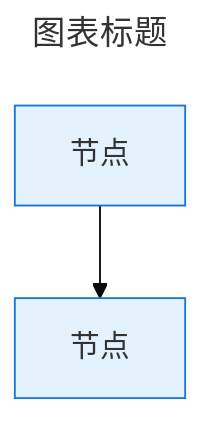
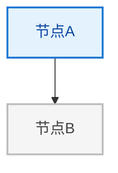

# Mermaid 主题配置

Mermaid 通过 `%%{init: {...}}%%` 指令或 frontmatter 配置主题。

## 方案一：Material Blue（默认）

适合：架构图、流程图、通用场景

```yaml
config:
  theme: base
  themeVariables:
    primaryColor: "#E3F2FD"
    primaryBorderColor: "#1976D2"
    primaryTextColor: "#0D47A1"
    secondaryColor: "#F5F5F5"
    secondaryBorderColor: "#BDBDBD"
    secondaryTextColor: "#424242"
    tertiaryColor: "#FFF8E1"
    tertiaryBorderColor: "#FFA000"
    tertiaryTextColor: "#E65100"
    lineColor: "#78909C"
    textColor: "#263238"
    mainBkg: "#E3F2FD"
    nodeBorder: "#1976D2"
```

classDef 样式：
```
classDef primary fill:#E3F2FD,stroke:#1976D2,stroke-width:2px,color:#0D47A1
classDef secondary fill:#F5F5F5,stroke:#BDBDBD,stroke-width:2px,color:#424242
classDef accent fill:#FFF8E1,stroke:#FFA000,stroke-width:2px,color:#E65100
classDef success fill:#E8F5E9,stroke:#43A047,stroke-width:2px,color:#1B5E20
classDef danger fill:#FFEBEE,stroke:#E53935,stroke-width:2px,color:#B71C1C
classDef storage fill:#FFF3E0,stroke:#EF6C00,stroke-width:2px,color:#BF360C
```

## 方案二：Purple Dream

适合：技术流程、数据管线

```yaml
config:
  theme: base
  themeVariables:
    primaryColor: "#EDE7F6"
    primaryBorderColor: "#5E35B1"
    primaryTextColor: "#311B92"
    secondaryColor: "#F5F5F5"
    secondaryBorderColor: "#9E9E9E"
    secondaryTextColor: "#424242"
    tertiaryColor: "#FCE4EC"
    tertiaryBorderColor: "#C2185B"
    tertiaryTextColor: "#880E4F"
    lineColor: "#7E57C2"
    textColor: "#263238"
```

classDef 样式：
```
classDef primary fill:#EDE7F6,stroke:#5E35B1,stroke-width:2px,color:#311B92
classDef secondary fill:#F5F5F5,stroke:#9E9E9E,stroke-width:2px,color:#424242
classDef accent fill:#FCE4EC,stroke:#C2185B,stroke-width:2px,color:#880E4F
classDef success fill:#E0F2F1,stroke:#00897B,stroke-width:2px,color:#004D40
classDef danger fill:#FFEBEE,stroke:#D32F2F,stroke-width:2px,color:#B71C1C
```

## 方案三：Forest Green

适合：系统运维、DevOps、基础设施

```yaml
config:
  theme: base
  themeVariables:
    primaryColor: "#E8F5E9"
    primaryBorderColor: "#2E7D32"
    primaryTextColor: "#1B5E20"
    secondaryColor: "#F1F8E9"
    secondaryBorderColor: "#7CB342"
    secondaryTextColor: "#33691E"
    tertiaryColor: "#FFF8E1"
    tertiaryBorderColor: "#F9A825"
    tertiaryTextColor: "#F57F17"
    lineColor: "#558B2F"
    textColor: "#263238"
```

classDef 样式：
```
classDef primary fill:#E8F5E9,stroke:#2E7D32,stroke-width:2px,color:#1B5E20
classDef secondary fill:#F1F8E9,stroke:#7CB342,stroke-width:2px,color:#33691E
classDef accent fill:#FFF8E1,stroke:#F9A825,stroke-width:2px,color:#F57F17
classDef success fill:#E0F2F1,stroke:#00897B,stroke-width:2px,color:#004D40
classDef danger fill:#FFEBEE,stroke:#E53935,stroke-width:2px,color:#B71C1C
```

## 方案四：Warm Sunset

适合：产品流程、用户旅程

```yaml
config:
  theme: base
  themeVariables:
    primaryColor: "#FFF3E0"
    primaryBorderColor: "#EF6C00"
    primaryTextColor: "#BF360C"
    secondaryColor: "#FBE9E7"
    secondaryBorderColor: "#BF360C"
    secondaryTextColor: "#8D2C13"
    lineColor: "#BF360C"
    textColor: "#263238"
```

classDef 样式：
```
classDef primary fill:#FFF3E0,stroke:#EF6C00,stroke-width:2px,color:#BF360C
classDef secondary fill:#FBE9E7,stroke:#BF360C,stroke-width:2px,color:#8D2C13
classDef accent fill:#FFFDE7,stroke:#F9A825,stroke-width:2px,color:#F57F17
classDef success fill:#E8F5E9,stroke:#43A047,stroke-width:2px,color:#1B5E20
classDef danger fill:#FFCDD2,stroke:#D32F2F,stroke-width:2px,color:#B71C1C
```

## 方案五：Monochrome

适合：正式文档、打印、黑白场景

```yaml
config:
  theme: base
  themeVariables:
    primaryColor: "#FFFFFF"
    primaryBorderColor: "#212121"
    primaryTextColor: "#212121"
    secondaryColor: "#F5F5F5"
    secondaryBorderColor: "#616161"
    secondaryTextColor: "#424242"
    lineColor: "#424242"
    textColor: "#212121"
```

classDef 样式：
```
classDef primary fill:#FFFFFF,stroke:#212121,stroke-width:2px,color:#212121
classDef secondary fill:#F5F5F5,stroke:#616161,stroke-width:2px,color:#424242
classDef accent fill:#EEEEEE,stroke:#212121,stroke-width:2px,color:#212121
```

## 使用方式

### 通过 frontmatter（推荐）



### 通过 classDef


