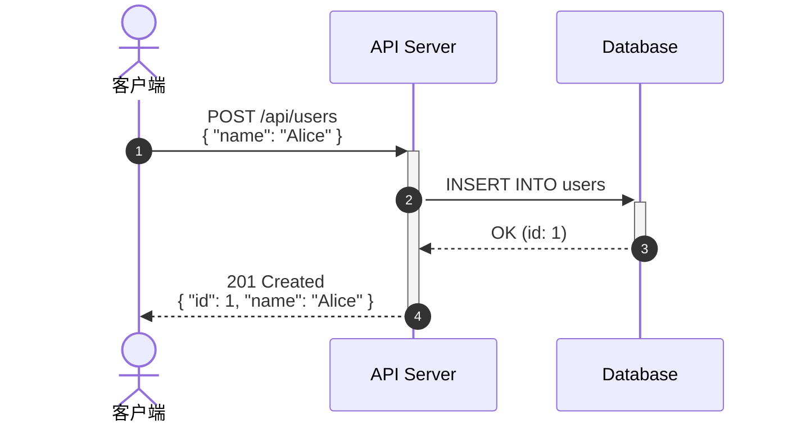
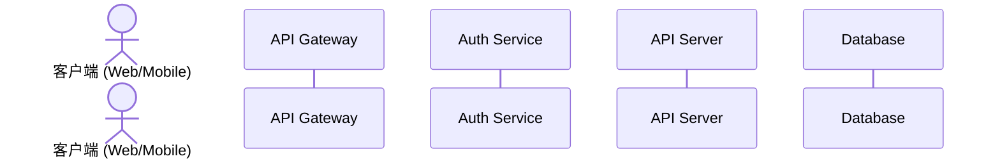
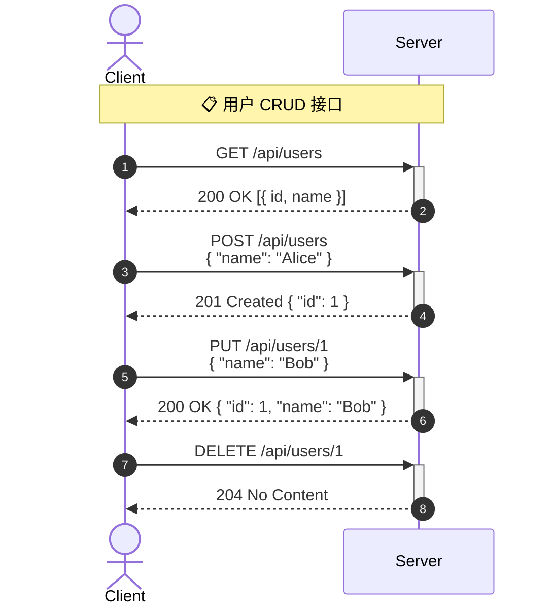
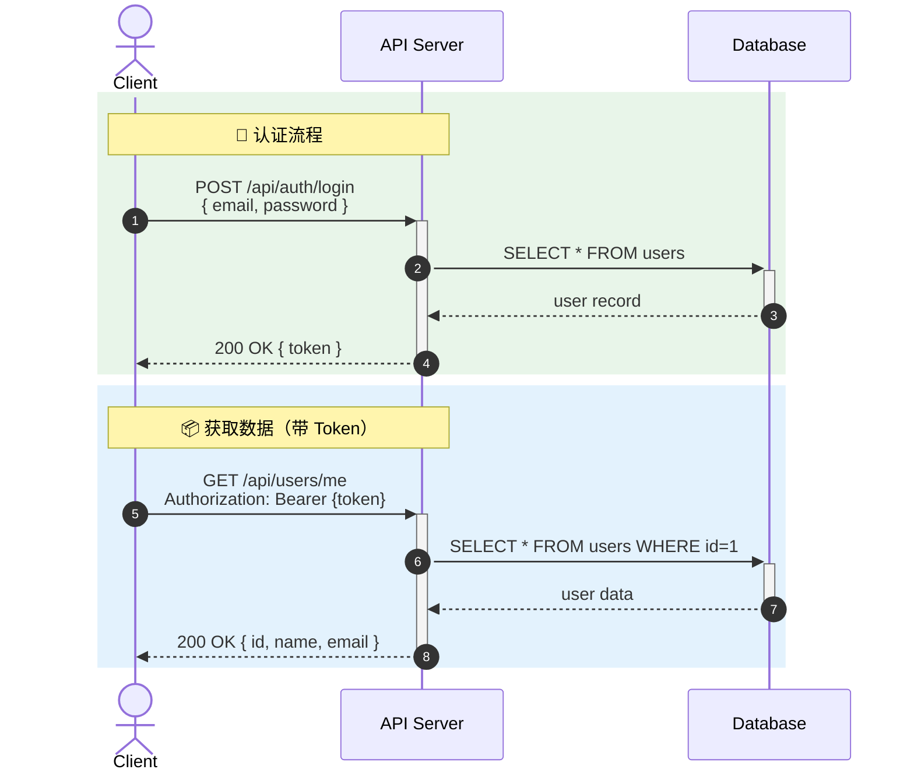
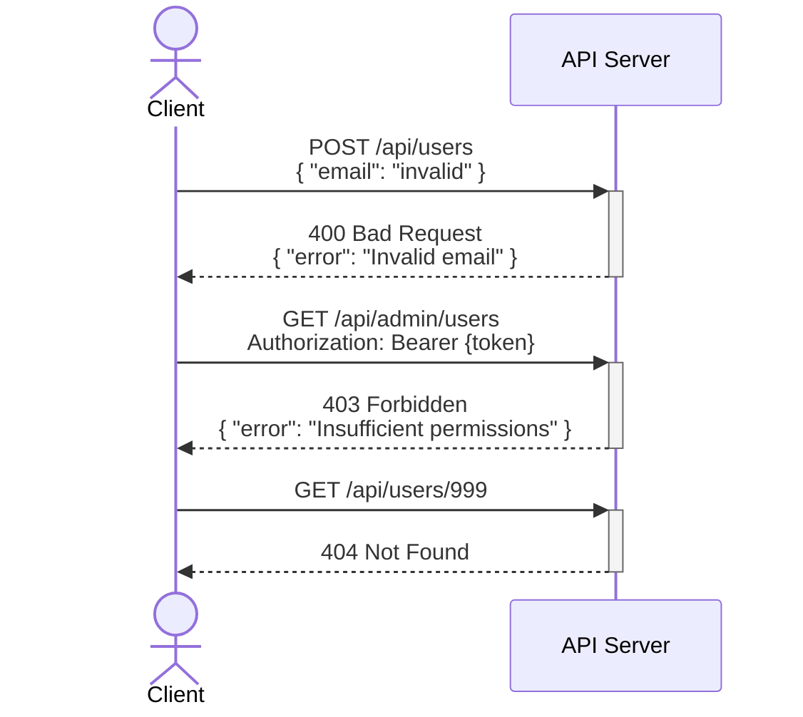
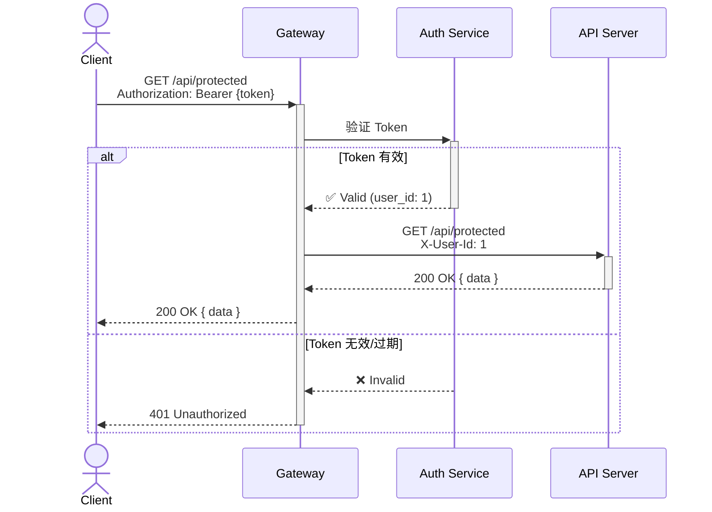
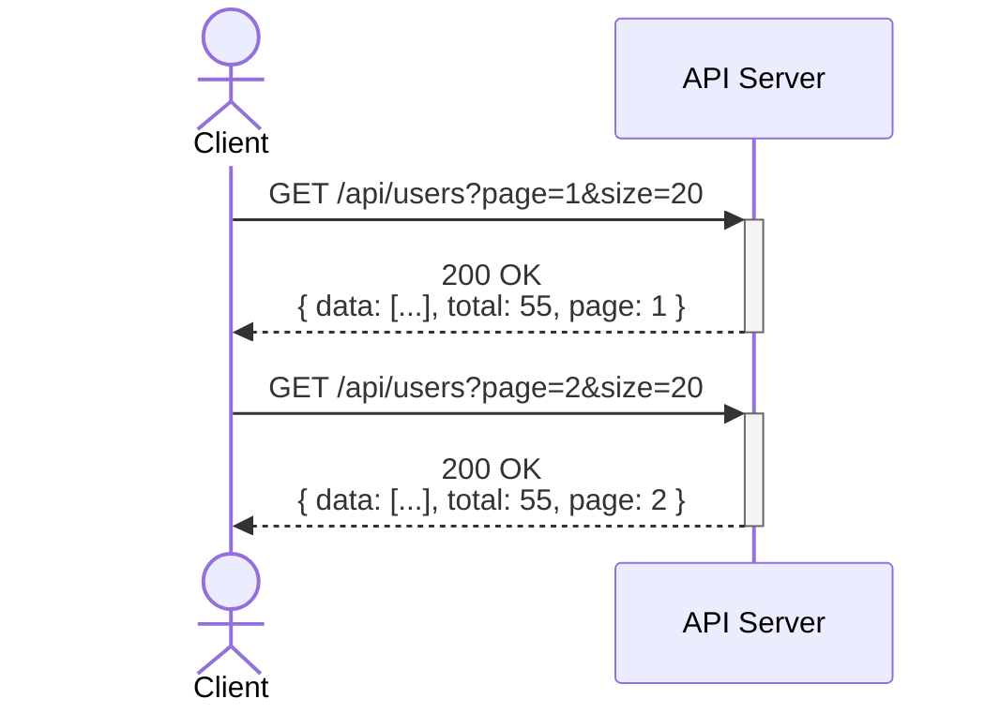
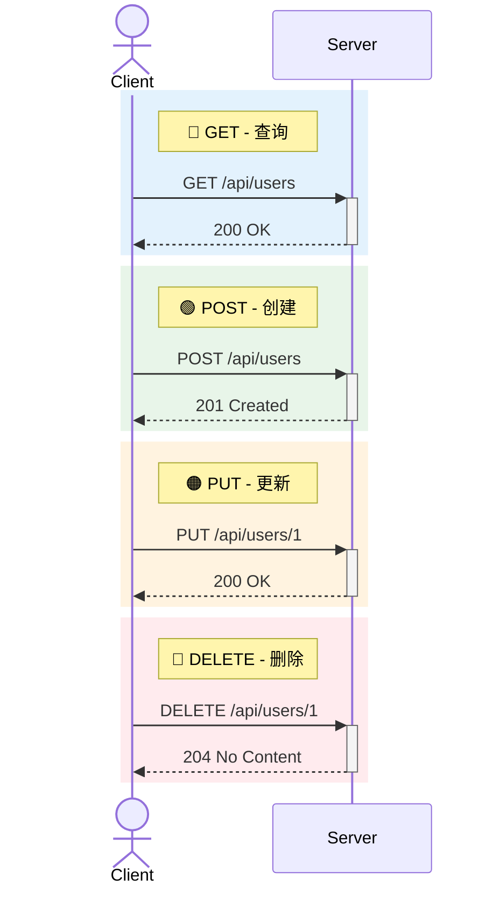

# Mermaid API 调用图绘制规则

## 基本结构

API 调用图基于 `sequenceDiagram`，专注展示 HTTP 请求/响应交互：



## 参与者声明



- 客户端用 `actor`（人形图标）
- 服务端用 `participant`（方框）
- 数据库用 `participant` + 名称标识

## HTTP 方法表示

用消息标签展示 HTTP 方法和路径：



## 请求/响应格式

### 请求消息格式

```
METHOD /path<br/>{ 关键参数 }
```

- 第一行：HTTP 方法 + 路径
- 第二行（可选）：请求体关键字段，用 `<br/>` 换行
- 不要放太多细节，保持简洁

### 响应消息格式

```
STATUS_CODE Status Text<br/>{ 关键返回字段 }
```

- 第一行：状态码 + 状态文字
- 第二行（可选）：响应体关键字段

## 场景分组

用 `rect` 彩色背景 或 `Note` 标注不同场景：



## 错误处理流程



## 条件分支（认证检查等）



## 分页查询



## 样式建议

使用 Note 标注 HTTP 方法的语义颜色：



## 复杂度控制

- 单张图最多 6-8 个 API 调用
- 参与者最多 4-5 个
- 请求/响应体只展示关键字段（2-3 个）
- 超过则按场景拆分
- 始终使用 `autonumber` 标注调用顺序
