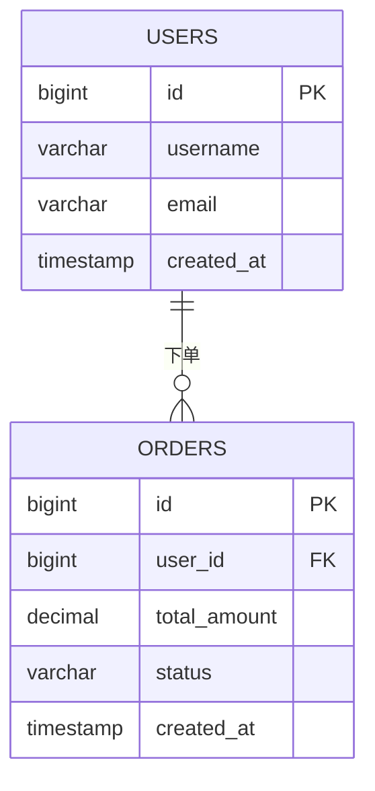
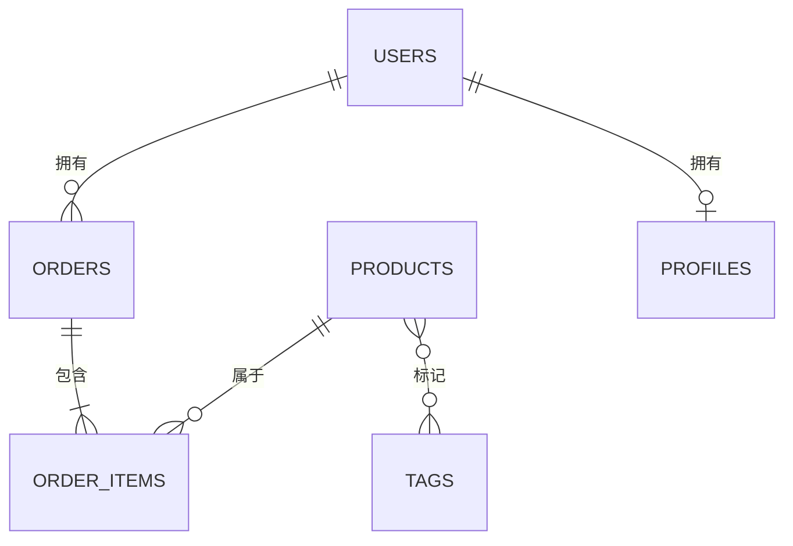

# Mermaid ER 图绘制规则

## 基本语法



## 实体定义

```mermaid
erDiagram
    TABLE_NAME {
        type column_name constraint "注释"
    }
```

- 实体名使用大写下划线风格：`USERS`, `ORDER_ITEMS`
- 每行一个字段：`类型 名称 约束`
- 约束标识：`PK`（主键）、`FK`（外键）、`UK`（唯一键）

### 常用数据类型

| 类型         | 适用场景       |
|-------------|--------------|
| `bigint`    | 主键、外键      |
| `varchar`   | 字符串         |
| `text`      | 长文本         |
| `int`       | 整数           |
| `decimal`   | 金额           |
| `boolean`   | 布尔值         |
| `timestamp` | 时间戳         |
| `json`      | JSON 数据      |

## 关系语法

```
A ||--o{ B : "关系描述"
```

### 基数标记

| 左侧    | 右侧    | 含义                    |
|---------|---------|------------------------|
| `\|\|`  | `\|\|`  | 有且仅有一个             |
| `\|\|`  | `o\|`   | 零个或一个              |
| `\|\|`  | `\|{`   | 一个或多个              |
| `\|\|`  | `o{`    | 零个或多个              |

### 线型

| 线型 | 语法 | 含义 |
|------|------|------|
| 实线 | `--` | 标识关系（identifying） |
| 虚线 | `..` | 非标识关系（non-identifying） |

### 关系示例



- `||--o{` — 一对多（一个用户有多个订单）
- `||--|{` — 一对多，必须至少一个
- `||--o|` — 一对零或一
- `}o--o{` — 多对多

## 实体分类与配色建议

Mermaid ER 图的样式有限，通过命名前缀区分实体类型：

- **核心实体**: 直接使用表名 — `USERS`, `ORDERS`
- **关联表**: 前缀加注释 — `ORDER_ITEMS`
- **配置表**: 在注释中标注 — `%% 配置表`

## 复杂度控制

- 单张图表最多 8-10 个实体
- 每个实体最多 8-10 个关键字段（省略不重要的字段）
- 关系描述简洁明了（2-4 个字）
- 超过限制则按领域/模块拆分
