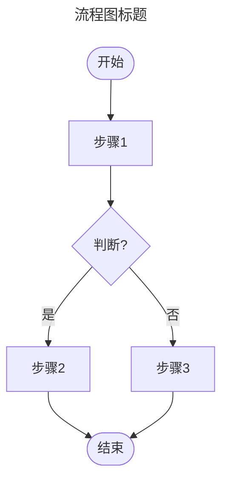
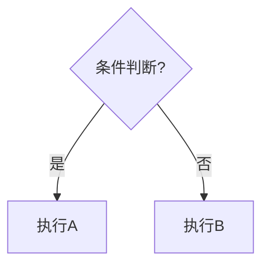
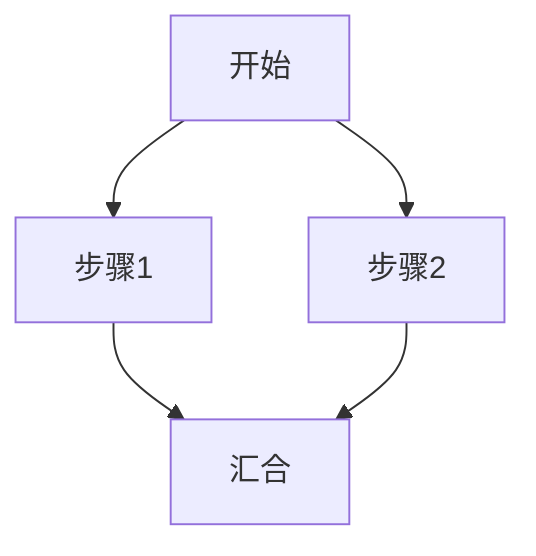
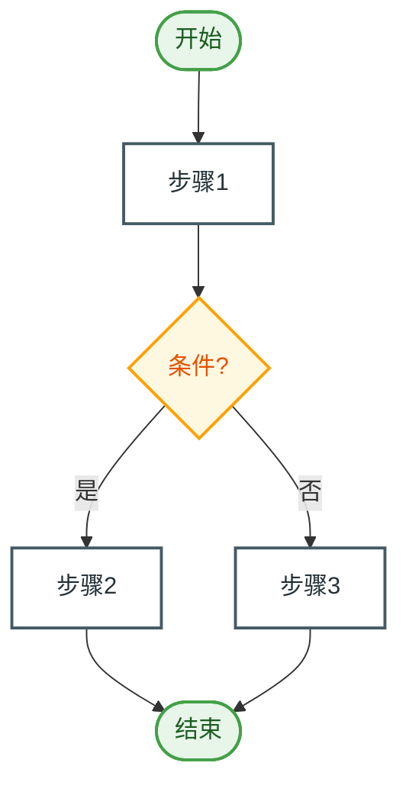

# Mermaid 流程图绘制规则

## 基本语法



## 方向选择

| 方向 | 语法 | 适用场景 |
|------|------|---------|
| 从上到下 | `flowchart TD` | 默认，大多数流程图 |
| 从左到右 | `flowchart LR` | 步骤多且无复杂分支 |

**默认使用 `TD`（Top-Down）。** 步骤超过 8 个且无复杂分支时可用 `LR`。

## 节点形状对应

| 含义       | Mermaid 语法        | 示例                |
|-----------|--------------------|--------------------|
| 开始/结束  | `A([文字])`        | `start([开始])`    |
| 处理步骤   | `A[文字]`          | `step1[验证数据]`   |
| 判断/条件  | `A{文字}`          | `check{是否通过?}`  |
| 输入/输出  | `A[/文字/]`        | `input[/用户输入/]` |
| 子流程     | `A[[文字]]`        | `sub[[子流程A]]`    |
| 数据存储   | `A[(文字)]`        | `db[(数据库)]`      |

## 分支规则

### 条件分支


- 分支标签放在 `|标签|` 中
- 是/否、成功/失败 等对称标签
- 分支结束后必须汇合

### 并行分支


## 样式规则



## 分阶段分组

当流程有多个阶段时，用子图：

```mermaid
flowchart TD
    subgraph 阶段一：输入
        A[步骤1] --> B[步骤2]
    end
    subgraph 阶段二：处理
        C[步骤3] --> D{判断}
    end
    subgraph 阶段三：输出
        E[步骤5]
    end
    B --> C
    D -->|是| E
```

## 连线语义

- **正常流程**: `A --> B`（实线箭头）
- **可选路径**: `A -.-> B`（虚线箭头）
- **主要路径**: `A ==> B`（粗线箭头）

## 步骤编号

超过 5 个步骤时，在标签前加序号：
```
step1[① 用户提交表单]
step2[② 验证输入数据]
step3[③ 调用后端 API]
```
