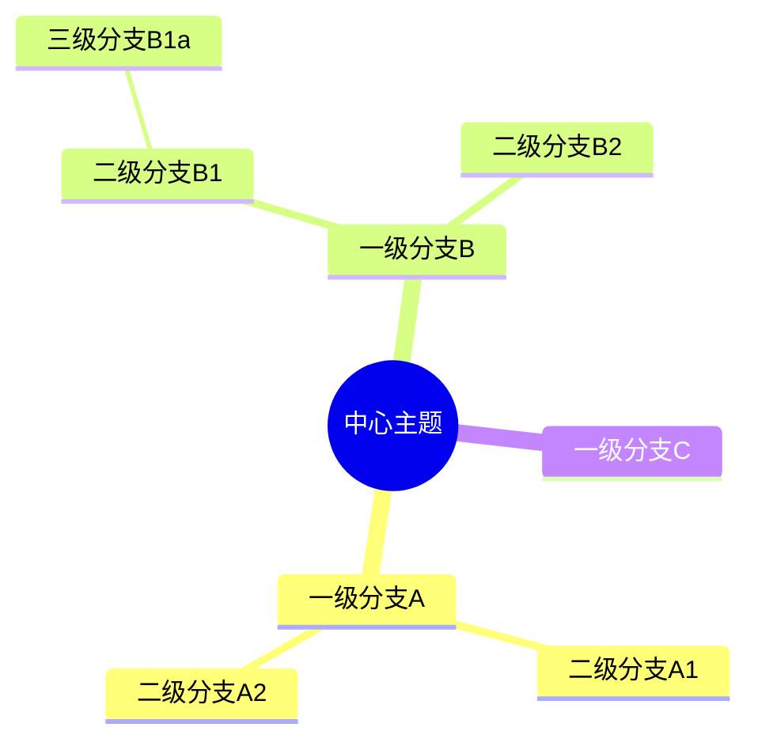
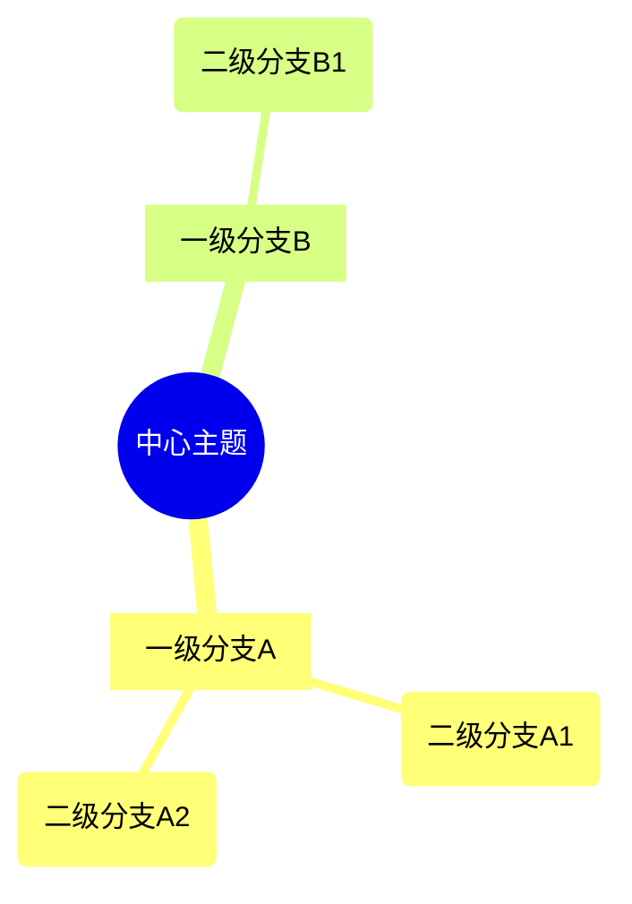
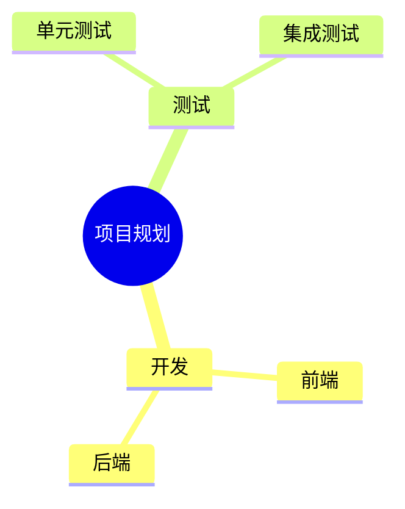

# Mermaid 思维导图绘制规则

## 基本语法

## 缩进规则

- 使用**空格缩进**表示层级关系（建议每级 2 或 4 个空格）
- 根节点是第一个非空行
- 子节点缩进比父节点多一级

## 节点形状

| 形状     | 语法                | 适用层级     |
|---------|---------------------|------------|
| 云朵形   | `root)中心主题(`     | L0 中心主题  |
| 圆形     | `root((中心主题))`   | L0 中心主题  |
| 方括号   | `[分支名称]`         | L1 一级分支  |
| 圆括号   | `(分支名称)`         | L2 二级分支  |
| 默认     | `分支名称`           | 任意层级     |

### 推荐的形状搭配

## 图标

可在节点前添加图标：

## 层级控制

| 层级 | 角色     | 建议节点数   |
|-----|---------|------------|
| L0  | 中心主题 | 1 个        |
| L1  | 一级分支 | 3-8 个      |
| L2  | 二级分支 | 每个 L1 下 2-5 个 |
| L3  | 三级分支 | 每个 L2 下 1-3 个 |

## 复杂度控制

- L1 分支最多 6-8 个
- 每个 L1 下的 L2 最多 4-5 个
- L3 一般不超过 3 个
- 总节点数控制在 30 以内
- 超过则拆成多张主题图

## 注意事项

- Mermaid mindmap 是较新的图表类型，语法简洁但样式自定义有限
- 不支持 `classDef` 样式定义
- 自动布局，无需手动指定坐标
- 中文内容直接书写即可
