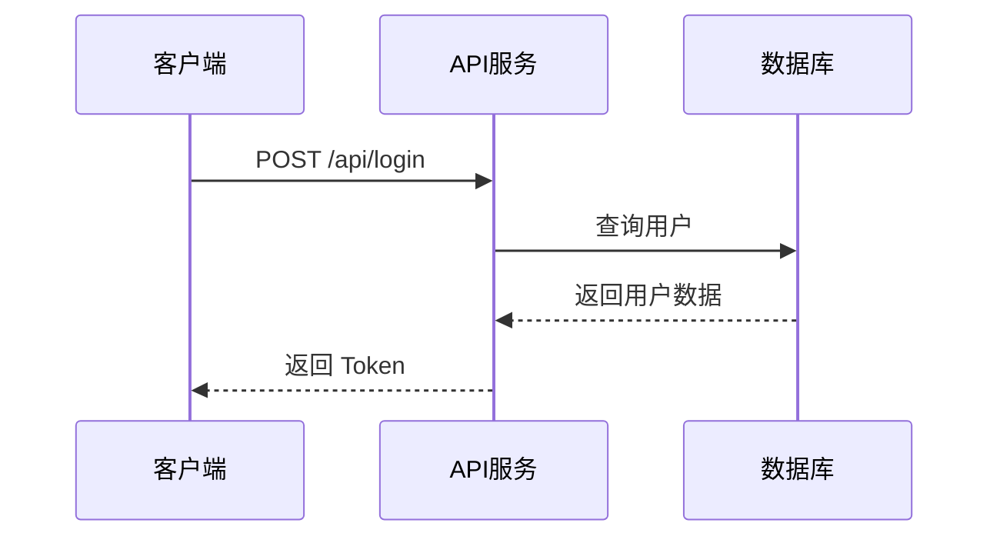
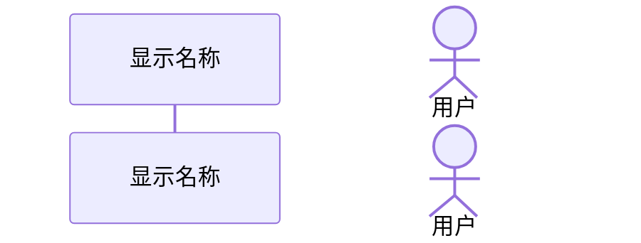
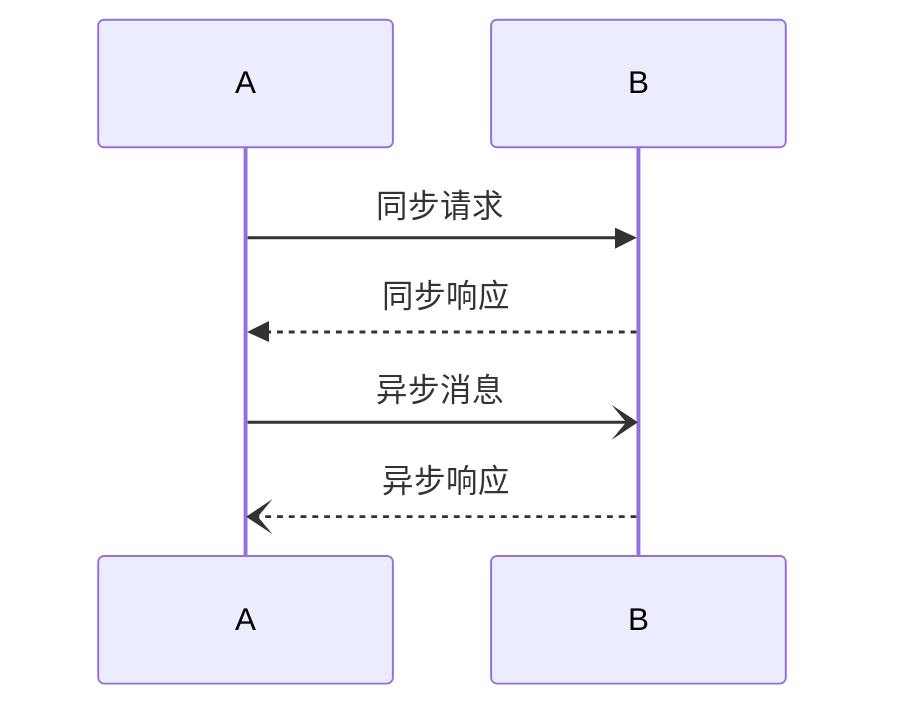
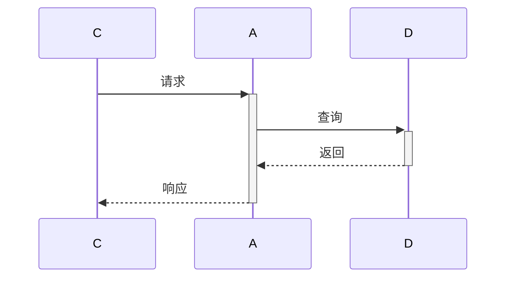
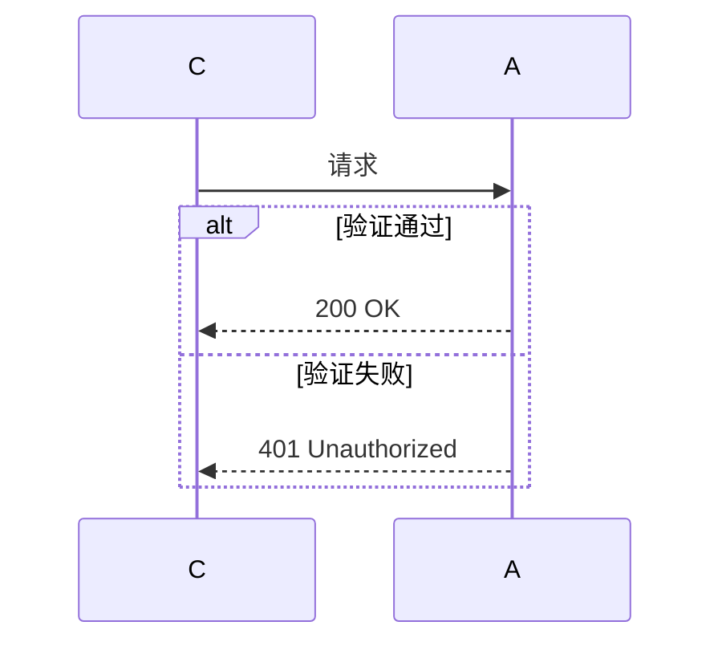
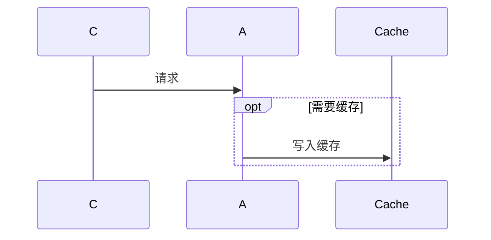
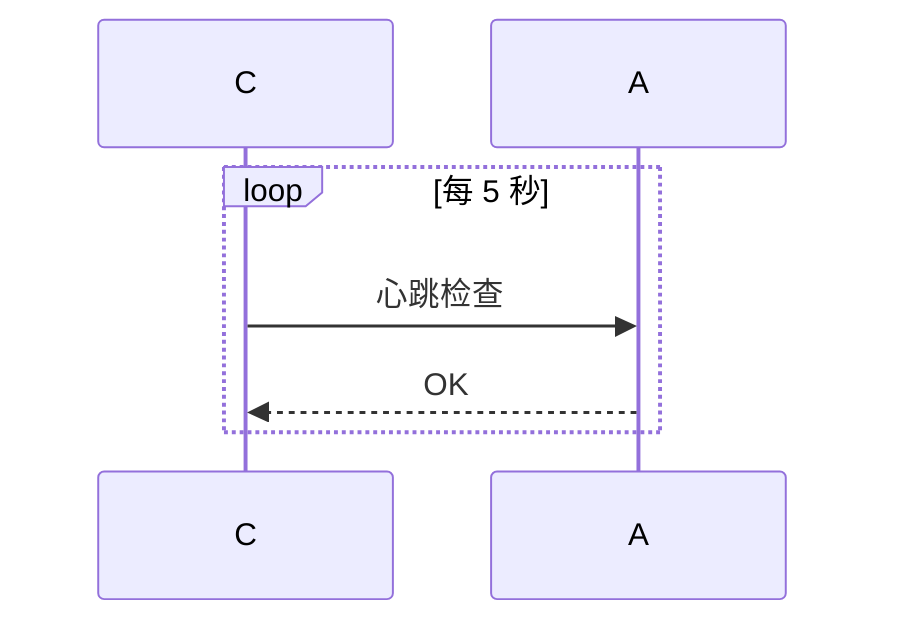
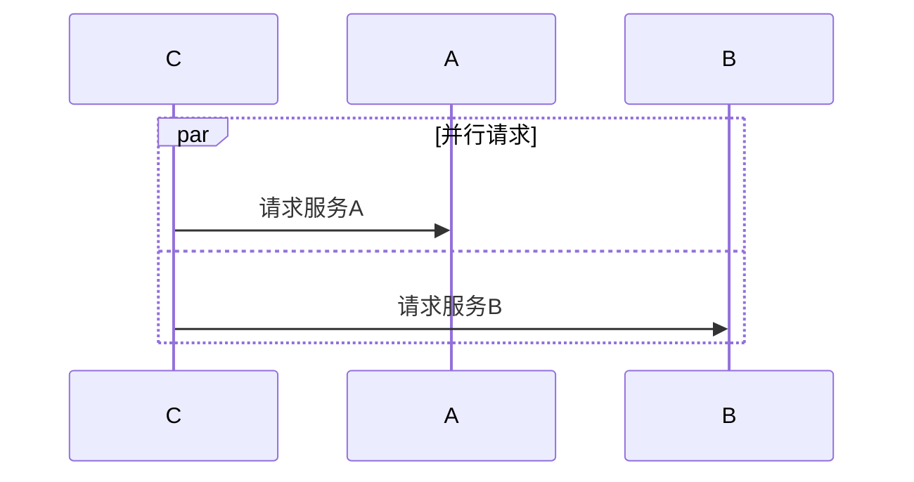
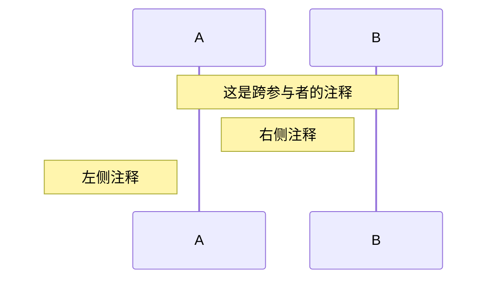
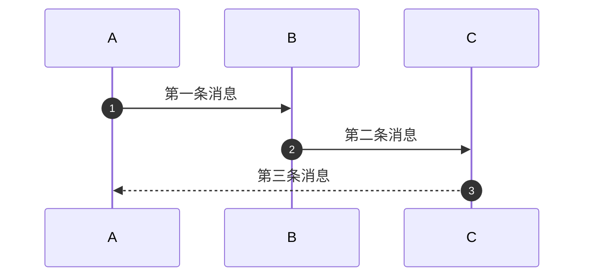

# Mermaid 时序图绘制规则

## 基本语法

## 参与者声明

- `participant` — 方框样式（服务/系统）
- `actor` — 人形图标（用户/操作员）
- `as` 后面是显示名称，支持中文
- 参与者声明顺序决定从左到右排列顺序

## 消息箭头类型

| 类型       | 语法     | 含义          |
|-----------|---------|---------------|
| 同步请求   | `->>` | 实线实心箭头    |
| 同步响应   | `-->>` | 虚线实心箭头    |
| 异步消息   | `-)` | 实线开放箭头    |
| 异步响应   | `--)` | 虚线开放箭头    |

## 激活框

- `+` 激活参与者（开始处理）
- `-` 停用参与者（处理完毕）
- 可嵌套激活

## 组合片段

### 条件分支（alt/else）

### 可选（opt）

### 循环（loop）

### 并行（par）

## 注释

## 序号

自动添加消息序号：

## 复杂度控制

- 参与者最多 6 个，超过则拆分
- 消息最多 15 条，超过则分阶段或拆图
- 嵌套组合片段最多 2 层
- 使用 `autonumber` 帮助阅读复杂时序
